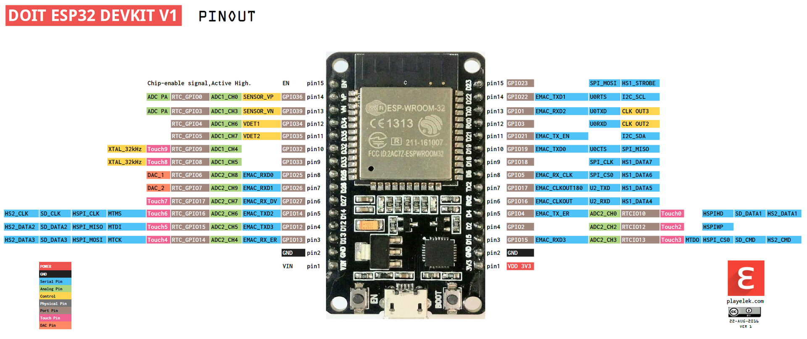

ESP32 DevKit V1

# Pinout

# Doc Links

* [Microcontrollers Lab](https://microcontrollerslab.com/esp32-pinout-use-gpio-pins/)

# Important Notes

* **ALL** GPIO pins support *pulse-width modulation* (*PWM*) and *interrupts*.
* GPIO pins 34 - 39 are for **input only**.
* **DO NOT** use pins 6-11.
* **DO** hold down 'BOOT' button after seeing "Connecting...." in Arduino IDE while uploading a sketch.
* **DO** press 'EN' after seeing "Hard resetting via RTS pin" in Arduino IDE after upload of a sketch completes to activate the program.
* **MAX** operating current for the GPIO pins (sourcing *and* sinking) is **40mA**.
  * **It is recommended** that it's kept below **20mA**
* The following GPIO pins are in active-high state by default during a reset/boot-up
  * 1
  * 3
  * 5
  * 6-11
  * 14
  * 15

## Strapping GPIO Pins

The following GPIO pins are used to configure the bootloader or manipulate the flashing mode of the ESP32[^1].

| Pin | Required Boot State |
| ---:| :---:               |
| 0   | N/A                 |
| 2   | N/A                 |
| 4   | N/A                 |
| 5   | HIGH                |
| 12  | LOW                 |
| 15  | HIGH                |
|||

[^1]: > **Note**: 
      > If you are using the [Arduino IDE](https://www.arduino.cc/en/software) you don't need to worry about initializing these pins.